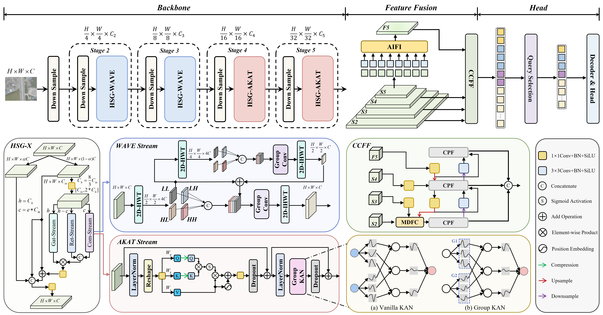

# FMC-DETR

> FMC-DETR: Frequency-Decoupled Multi-Domain Coordination for Aerial-View Object Detection

## Overview

Remote sensing object detection is a critical technology for real-world applications such as natural resource monitoring, traffic management, and UAV-based rescue. Detecting tiny objects in high-resolution aerial imagery remains challenging due to weak visual cues and insufficient global context modeling in complex scenes. Existing methods often suffer from delayed contextual interaction and limited nonlinear reasoning, which restrict their ability to effectively refine shallow representations and ultimately lead to suboptimal performance. To address these challenges, we propose FMC-DETR, a frequency-decoupled fusion framework for aerial-view object detection. First, we propose the Wavelet Kolmogorov-Arnold Transformer (WeKat) backbone, which employs cascaded wavelet transforms to enhance global low-frequency structure perception in shallow features while preserving fine-grained details, and further leverages Kolmogorov-Arnold networks for adaptive nonlinear modeling of multi-scale dependencies. Second, we introduce the Multi-Domain Feature Coordination (MDFC) module, which refines cross-scale fused representations through partial-channel spatial, spectral, and structural coordination, thereby strengthening small-object-related feature responses in cluttered scenes. Finally, we design the Compact Partial Fusion (CPF) module, which performs compact multi-branch aggregation with progressive partial refinement to improve feature diversity and multi-scale interaction while preserving stable information flow and reducing redundant perturbation. Extensive experiments across multiple remote sensing benchmarks demonstrate that FMC-DETR achieves state-of-the-art performance and significantly outperforming the baseline detector.

**The manuscript is currently under review. The full implementation has now been released for academic research and reproducibility.**

## Framework

<!-- Replace the image path below with your own figure path. For example: assets/FMC-DETR.png -->

<p align="center">
  
</p>

<p align="center">
  <b>Figure 1. Overall architecture of FMC-DETR.</b>
</p>

## Code Release

This repository provides the complete implementation of FMC-DETR, including:

- Training code
- Validation code
- Inference code
- Model architecture
- Configuration files
- Modified Ultralytics framework
- FMC-DETR related modules
- Prediction and evaluation scripts

## Repository Structure

The main implementation of FMC-DETR is organized as follows:

```text
FMC-DETR/
├── ultralytics/
│   ├── nn/
│   │   ├── extra_modules/
│   │   │   ├── rational_kat_cu/
│   │   │   └── ...
│   │   └── ...
│   └── ...
├── assets/
├── configs/
├── requirements.txt
└── README.md
```

---

## Environment Setup

### 1. Install Dependencies

Install the required Python packages:

```bash
pip install -r requirements.txt
```

Install PyTorch according to your CUDA version.

For CUDA 12.1, you may use:

```bash
pip install torch==2.3.0 torchvision==0.18.0 torchaudio==2.3.0 --index-url https://download.pytorch.org/whl/cu121
```

---

### 2. Compile Rational-KAT CUDA/Triton Extension

The Rational-KAT CUDA/Triton extension used by FMC-DETR is located in:

```text
ultralytics/nn/extra_modules/rational_kat_cu/
```

Before training or inference, please compile and install the extension.

Enter the directory:

```bash
cd ultralytics/nn/extra_modules/rational_kat_cu
```

Install Triton:

```bash
pip install triton==3.1.0
```

Compile and install the extension:

```bash
pip install -e .
```

---

## Current Release

This repository currently includes:

- Training code
- Validation code
- Inference code
- Model architecture
- Configuration files
- Prediction and evaluation scripts
- FMC-DETR related modules

---

## Notes

The manuscript is currently under review.

Citation information will be updated after the paper is officially accepted or publicly available.

For questions, discussions, or academic collaboration, please open an issue or contact via email.

---
